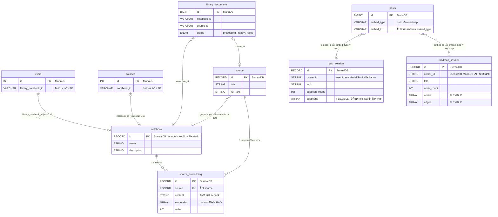

# ผังฐานข้อมูล SIET Space (ER Diagram)

สร้างจากฐานข้อมูลจริงที่รันอยู่ ไม่ใช่จากการออกแบบบนกระดาษ — ตรวจแล้วว่าชื่อตาราง
และชื่อคอลัมน์ทุกตัวตรงกับ `information_schema` ของ MariaDB (13 ตาราง 118 คอลัมน์)
และผ่าน parser ของ Mermaid แล้วทั้งสองผัง

**สัญลักษณ์ที่ใช้**

| สัญลักษณ์ | ความหมาย |
|---|---|
| `\|\|--o{` | หนึ่ง ต่อ ศูนย์หรือหลาย (ฝั่งขวาต้องมีฝั่งซ้ายเสมอ) |
| `\|o--o{` | ศูนย์หรือหนึ่ง ต่อ ศูนย์หรือหลาย (คอลัมน์นั้นเป็น NULL ได้) |
| `\|o--o\|` | ศูนย์หรือหนึ่ง ต่อ ศูนย์หรือหนึ่ง (1:1 แบบไม่บังคับ) |
| `}o--\|\|` | ศูนย์หรือหลาย ต่อ หนึ่ง |
| `PK` `FK` `UK` | Primary key · Foreign key เชิงตรรกะ · Unique key |

> **หมายเหตุสำคัญ:** `FK` ในผังนี้เป็นความสัมพันธ์**เชิงตรรกะ** ฐานข้อมูลจริง
> ไม่ได้ประกาศ `FOREIGN KEY` constraint ไว้สักตัว ความถูกต้องของข้อมูลบังคับ
> ด้วยโค้ดแอปพลิเคชันทั้งหมด

---

## 1. ฐานข้อมูลหลัก — MariaDB

```mermaid
erDiagram
    %% ============================================================
    %% SIET Space — ฐานข้อมูล MariaDB (workspace) · 13 ตาราง
    %% ============================================================

    %% ---------- บัญชีผู้ใช้กับห้องเรียน ----------
    users          |o--o{ courses            : "created_by (NULL = ห้องที่ระบบสร้าง)"
    users          ||--o{ course_members     : "user_id"
    courses        ||--o{ course_members     : "course_id"

    %% ---------- ฟีดชุมชน ----------
    users          ||--o{ posts              : "author_id"
    courses        |o--o{ posts              : "course_id (NULL = ฟีดรวม)"
    posts          ||--o{ post_comments      : "post_id"
    users          ||--o{ post_comments      : "author_id"
    posts          ||--o{ post_reactions     : "post_id"
    users          ||--o{ post_reactions     : "user_id"
    posts          ||--o{ post_shares        : "post_id"
    users          ||--o{ post_shares        : "user_id"
    posts          ||--o{ saved_items        : "post_id"
    users          ||--o{ saved_items        : "user_id"
    posts          ||--o{ quiz_plays         : "post_id"
    users          ||--o{ quiz_plays         : "user_id"

    %% ---------- แต้ม การแจ้งเตือน คลังความรู้ ----------
    users          ||--o{ point_transactions : "user_id"
    users          ||--o{ notifications      : "user_id (ผู้รับ)"
    users          |o--o{ notifications      : "actor_id (ผู้ก่อเหตุ)"
    posts          |o--o{ notifications      : "post_id"
    users          ||--o{ library_documents  : "owner_id"
    courses        |o--o{ library_documents  : "course_id (NULL = คลังส่วนตัว)"
    posts          |o--o| library_documents  : "post_id (แชร์ขึ้นฟีด)"
    users          ||--o{ rag_sessions       : "user_id"

    users {
        INT id PK "AUTO_INCREMENT"
        VARCHAR username UK "3-32 ตัวอักษร"
        VARCHAR password_hash "NULL ได้ ถ้าเข้าด้วย Google"
        VARCHAR display_name
        ENUM role "student / teacher / admin"
        VARCHAR email UK "โดเมน kmitl.ac.th"
        VARCHAR google_sub UK "subject id จาก Google"
        VARCHAR avatar_url
        VARCHAR student_id "รหัสนักศึกษา 8 หลัก - ไม่ใช่ FK"
        INT points_balance "ยอดแต้มคงเหลือ"
        VARCHAR library_notebook_id "ชี้ไป SurrealDB notebook"
        TINYINT disabled "1 = ถูกระงับ"
        DATETIME created_at
        DATETIME updated_at
        DATETIME last_login_at
    }

    courses {
        INT id PK "AUTO_INCREMENT"
        VARCHAR code UK "CS101 หรือ TALK-9F2C1B"
        VARCHAR name
        VARCHAR description
        ENUM kind "course = ห้องวิชา / club = ห้องพูดคุย"
        INT created_by FK "users.id - NULL ได้"
        VARCHAR notebook_id "ชี้ไป SurrealDB notebook"
        DATETIME created_at
    }

    course_members {
        INT course_id PK "และเป็น FK courses.id"
        INT user_id PK "และเป็น FK users.id"
        DATETIME joined_at
    }

    posts {
        BIGINT id PK "AUTO_INCREMENT"
        INT author_id FK "users.id"
        INT course_id FK "courses.id - NULL ได้"
        ENUM type "summary / question / quiz / roadmap / material"
        VARCHAR title
        TEXT content
        VARCHAR tags
        VARCHAR attachment_name
        VARCHAR attachment_path
        INT attachment_size
        VARCHAR attachment_mime
        VARCHAR embed_type "quiz หรือ roadmap"
        VARCHAR embed_id "ชี้ไป SurrealDB session"
        LONGTEXT embed_snapshot "สำเนาข้อมูลตอนแชร์"
        INT like_count "ตัวนับซ้ำกับ post_reactions"
        INT helpful_count
        INT comment_count
        INT share_count
        INT play_count
        INT follow_count
        INT cashback_earned "แต้มคืนสะสม สูงสุด 15"
        TINYINT is_deleted "1 = ซ่อน กู้คืนได้"
        CHAR content_hash "MD5 กันโพสต์ซ้ำ"
        DATETIME created_at
        DATETIME updated_at
    }

    post_comments {
        BIGINT id PK
        BIGINT post_id FK "posts.id"
        INT author_id FK "users.id"
        TEXT content
        DATETIME created_at
    }

    post_reactions {
        BIGINT post_id PK "และเป็น FK posts.id"
        INT user_id PK "และเป็น FK users.id"
        ENUM kind PK "like หรือ helpful"
        DATETIME created_at
    }

    post_shares {
        BIGINT post_id PK "และเป็น FK posts.id"
        INT user_id PK "1 คนแชร์ได้ครั้งเดียวต่อโพสต์"
        DATETIME created_at
    }

    saved_items {
        INT user_id PK "และเป็น FK users.id"
        BIGINT post_id PK "และเป็น FK posts.id"
        DATETIME created_at
    }

    quiz_plays {
        BIGINT id PK "PK เดี่ยว - เล่นซ้ำได้หลายครั้ง"
        BIGINT post_id FK "posts.id"
        INT user_id FK "users.id"
        INT score
        INT total
        TINYINT completed
        TINYINT cashback_paid "กันจ่ายแต้มคืนซ้ำ"
        DATETIME created_at
        DATETIME completed_at
    }

    point_transactions {
        BIGINT id PK
        INT user_id FK "users.id"
        INT delta "บวก = ได้ ลบ = ใช้"
        INT balance_after "ยอดหลังรายการ ตรวจย้อนหลังได้"
        VARCHAR kind "welcome / quiz_generate / share_bonus ..."
        VARCHAR ref_type "post / quiz_session / ..."
        VARCHAR ref_id "polymorphic - ใส่ FK ไม่ได้"
        VARCHAR note
        DATETIME created_at
    }

    notifications {
        BIGINT id PK
        INT user_id FK "users.id - ผู้รับ"
        INT actor_id FK "users.id - ผู้ก่อเหตุ NULL ได้"
        BIGINT post_id FK "posts.id - NULL ได้"
        VARCHAR kind "like / comment / share / helpful"
        VARCHAR message
        TINYINT is_read
        DATETIME created_at
    }

    library_documents {
        BIGINT id PK
        INT owner_id FK "users.id"
        INT course_id FK "courses.id - NULL = คลังส่วนตัว"
        BIGINT post_id FK "posts.id - NULL ถ้าไม่ได้แชร์ขึ้นฟีด"
        ENUM scope "course หรือ personal"
        ENUM kind "file / url / text"
        VARCHAR title
        VARCHAR filename
        VARCHAR file_path
        VARCHAR mime
        INT size
        VARCHAR notebook_id "ชี้ไป SurrealDB notebook"
        VARCHAR source_id "ชี้ไป SurrealDB source"
        ENUM status "processing / ready / failed"
        VARCHAR error
        INT chunks "จำนวนชิ้นที่ตัดเพื่อทำ embedding"
        INT chars
        CHAR content_hash "MD5 กันอัปซ้ำ"
        DATETIME created_at
        DATETIME updated_at
    }

    rag_sessions {
        VARCHAR id PK "UUID ที่แอปสร้าง ไม่ใช่ AUTO_INCREMENT"
        INT user_id FK "users.id"
        INT credits_left "ข้อความที่เหลือในเซสชัน"
        LONGTEXT messages "ประวัติสนทนา JSON"
        DATETIME created_at
        DATETIME updated_at
    }
```

---

## 2. สะพานข้ามไป SurrealDB

MariaDB เก็บ record id ของ SurrealDB ไว้เป็นข้อความ (เช่น `notebook:1kn470cafxdd5424m2r4`)
จึงไม่มีทางประกาศ FK ข้ามฐานข้อมูลได้ และไม่มี transaction ร่วมกันด้วย

---

## 3. ตารางสรุปคีย์

| ตาราง | Primary Key | Unique | หมายเหตุ |
|---|---|---|---|
| `users` | `id` | `username`, `email`, `google_sub` | |
| `courses` | `id` | `code` | `kind` แยกห้องวิชา/ห้องพูดคุย |
| `course_members` | `course_id + user_id` | — | composite กันเข้าร่วมซ้ำ |
| `posts` | `id` | — | `course_id` NULL = ฟีดรวม |
| `post_comments` | `id` | — | ลบจริง ไม่ soft delete |
| `post_reactions` | `post_id + user_id + kind` | — | กด like และ helpful ได้อย่างละครั้ง |
| `post_shares` | `post_id + user_id` | — | 1 คนแชร์ได้ครั้งเดียวต่อโพสต์ |
| `saved_items` | `user_id + post_id` | — | |
| `quiz_plays` | `id` | — | PK เดี่ยว เพราะเล่นซ้ำได้ |
| `point_transactions` | `id` | — | `ref_id` เป็น polymorphic |
| `notifications` | `id` | — | ชี้ไป `users` สองทาง (`user_id`, `actor_id`) |
| `library_documents` | `id` | — | สะพานไป SurrealDB 2 คอลัมน์ |
| `rag_sessions` | `id` (VARCHAR) | — | UUID จากแอป ไม่ใช่ AUTO_INCREMENT |
